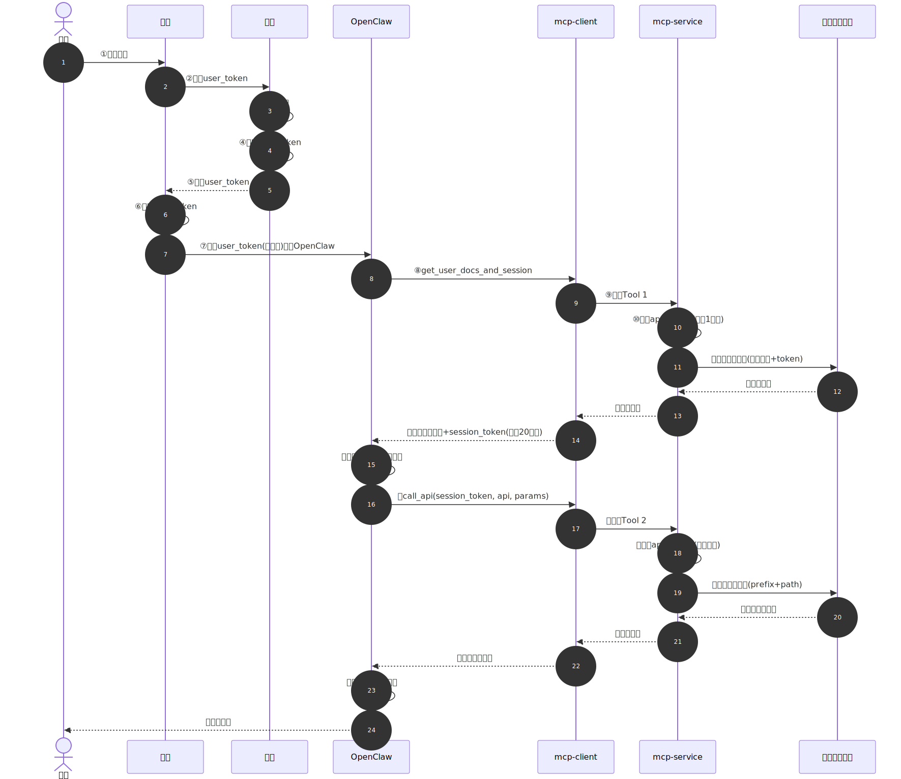
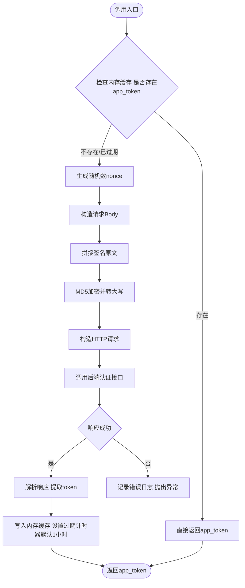
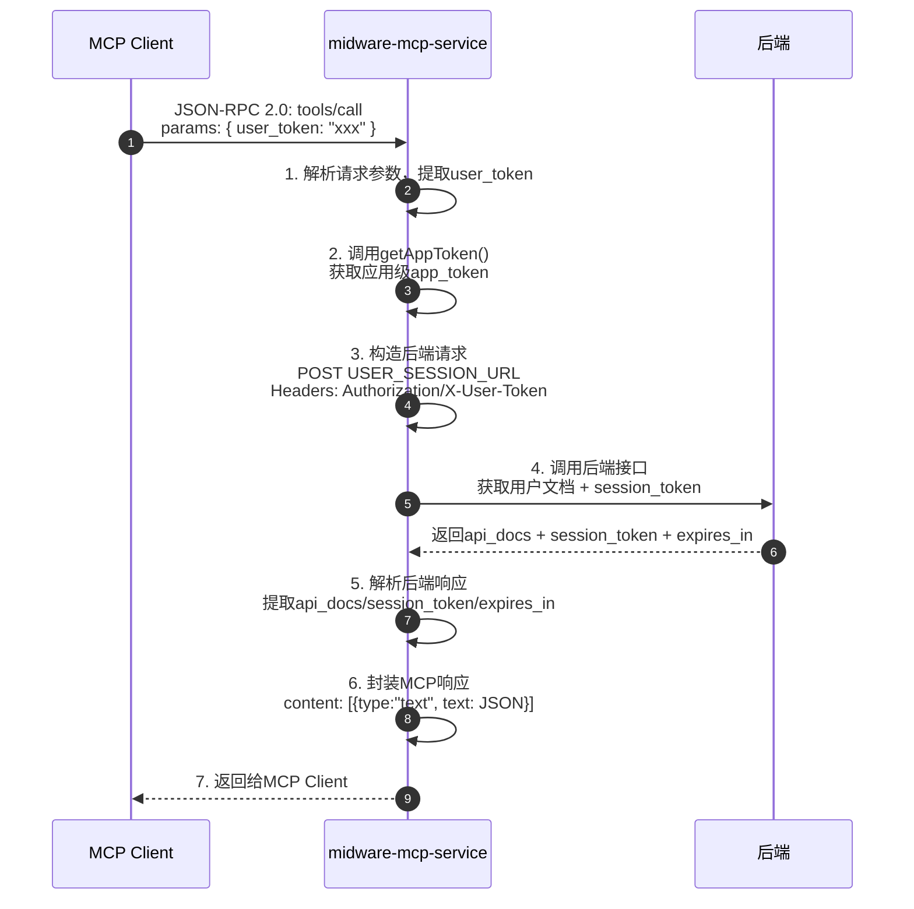
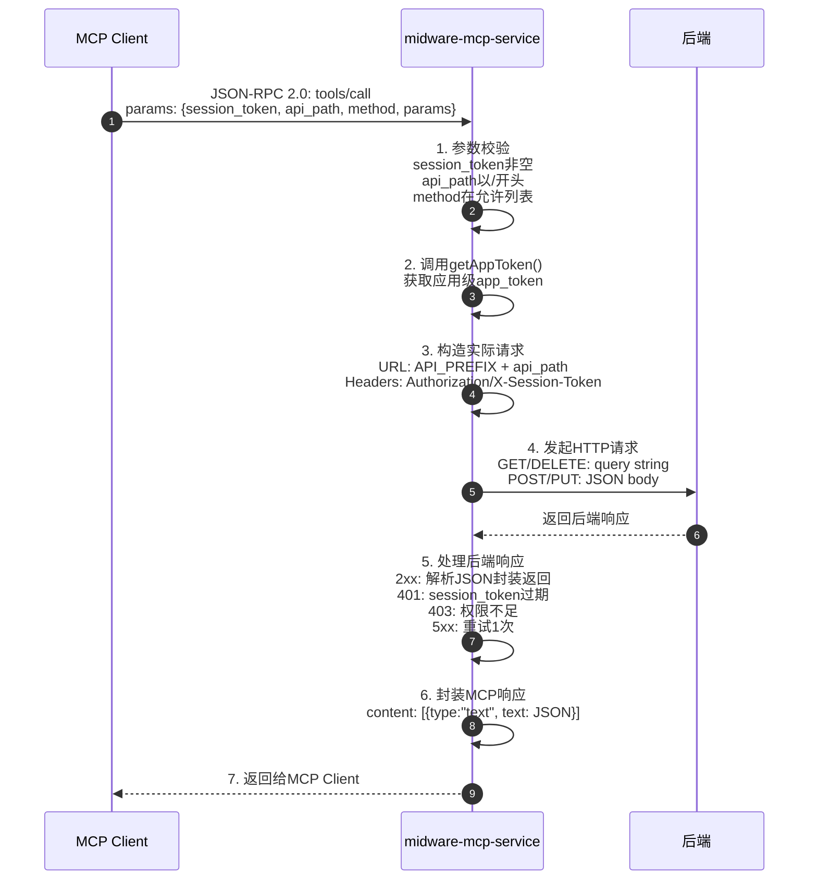
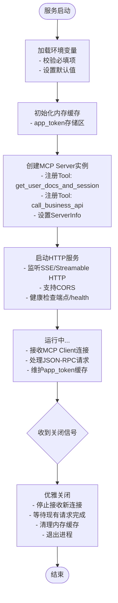
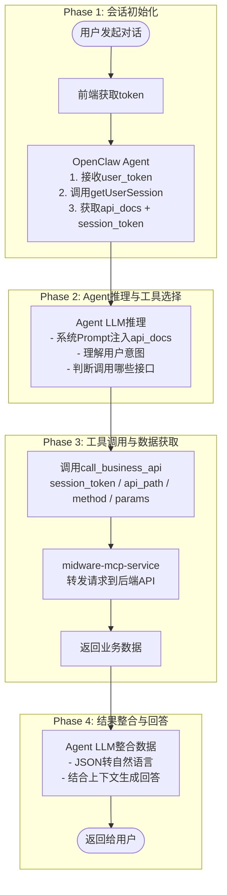
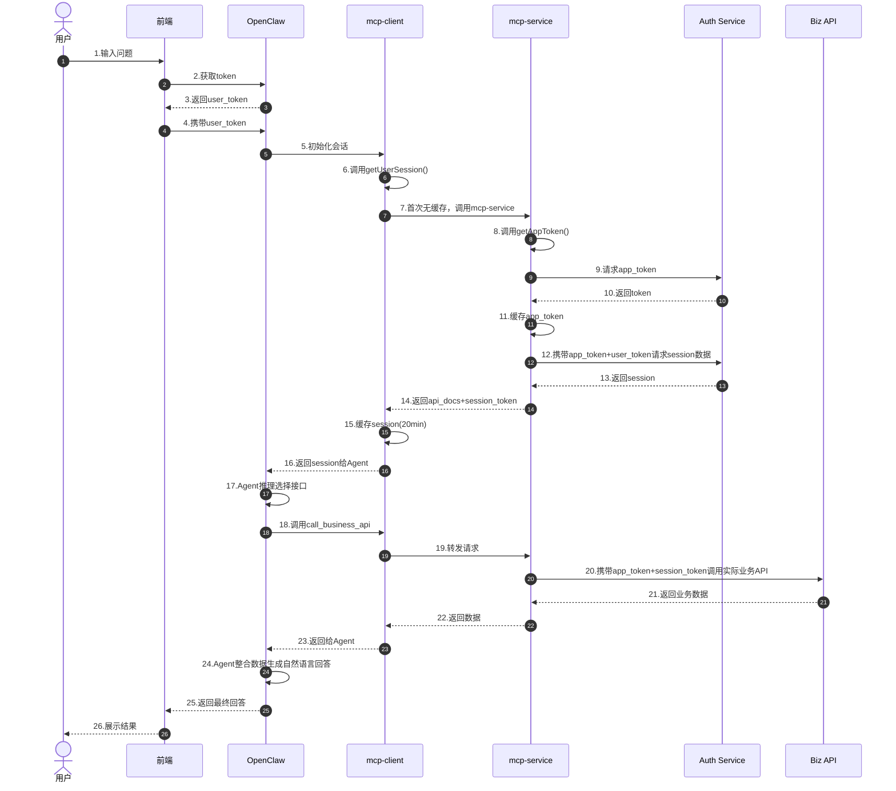

# Midware MCP 服务搭建详细文档

> **文档版本**: v1.0  
> **创建日期**: 2026-07-10  
> **适用对象**: OpenClaw 集成场景  
> **协议标准**: Model Context Protocol (MCP) 2026  

---

## 一、整体架构概览

### 1.1 系统角色定义

本方案涉及五个核心角色，构成完整的请求链路：

| 角色 | 名称 | 职责描述 |
|------|------|----------|
| **用户** | End User | 在前端界面发起自然语言请求 |
| **前端** | Frontend App | 获取临时用户Token，组装请求并调用OpenClaw |
| **OpenClaw** | AI Agent Host | 作为MCP Host，承载Agent运行时，通过MCP Client连接MCP Server |
| **MCP客户端** | midware-mcp-client | 嵌入OpenClaw内部，缓存用户会话数据，代理工具调用 |
| **MCP服务端** | midware-mcp-service | 提供MCP Tools，桥接后端业务API，管理应用级认证 |
| **后端** | midware | 实际业务系统，提供用户认证、接口文档及业务数据API |

### 1.2 完整请求链路



---

## 二、MCP服务端 (midware-mcp-service) 设计

### 2.1 服务定位

`midware-mcp-service` 是一个独立的 **MCP Server**，采用 **Streamable HTTP** 或 **SSE** 传输协议暴露MCP能力。它本身不直接面向最终用户，而是作为OpenClaw与后端业务系统之间的认证与数据桥梁。

### 2.2 环境变量配置

| 环境变量名               | 类型   | 必填  |      说明                     | 示例值                                                    |
| ----------------------- | ------ | ---- | ----------------------------- | ------------------------------------------------------ |
| `API_PREFIX`            | string | 是   | 后端实际API的请求地址前缀         | `https://api.midware.example.com`                      |
| `APP_ID`                | string | 是   | 应用标识，用于获取应用级Token      | `app_xxx123`                                           |
| `APP_SECRET`            | string | 是   | 应用密钥，用于获取应用级Token      | `sec_xxx456`                                           |
| `APP_TOKEN_URL`         | string | 是   | 获取应用Token的接口完整URL      | `https://auth.midware.example.com/oauth/token`         |
| `USER_SESSION_URL`      | string | 是   | 获取用户文档和临时会话Token的接口URL | `https://auth.midware.example.com/api/v1/user/session` |
| `APP_TOKEN_TTL_SECONDS` | int    | 否   | 应用Token缓存有效期（默认3600秒）  | `3600`                                                 |
| `SERVER_PORT`           | int    | 否   | MCP服务监听端口（默认3000）      | `3000`                                                 |
| `LOG_LEVEL`             | string | 否   | 日志级别（默认info）           | `info`                                                 |

### 2.3 私有方法：应用Token管理

#### 方法名：`getAppToken()`

**功能描述**：
获取并缓存应用级Token（`app_token`）。该Token用于服务端调用后端API时的身份认证，与用户级Token（`user_token`）是不同维度的凭证。

**执行逻辑**：

后端认证接口采用 **签名认证** 方式（非 OAuth2 client_credentials），MCP服务端需按以下规则构造签名请求：

**签名算法步骤**：
1. 从请求Body构建有序参数字符串：将Body JSON按Key升序排序，拼接为 `key1:value1&key2:value2` 格式
2. 拼接签名原文：`appId={APP_ID}&body={有序参数字符串}&nonce={随机数}&secreteKey={APP_SECRET}`
3. 计算MD5并转大写：`MD5(签名原文).toUpperCase()`
4. 将签名值放入请求头 `Sign`



**缓存策略**：
- 使用进程内内存缓存（如 Node.js 的 `Map` 或 Python 的 `dict`）
- 缓存Key固定为 `__app_token__`
- 过期时间：从响应体中的 `expires_in` 字段读取，若不存在则使用默认值 `APP_TOKEN_TTL_SECONDS`（3600秒）
- 过期前5分钟可触发预刷新（可选优化）

**错误处理**：
- 网络超时：重试3次，每次间隔2秒，仍失败则抛出 `AppTokenFetchError`
- 认证失败（401）：直接抛出 `AppAuthError`，不进入重试
- 服务端错误（5xx）：重试3次后抛出 `AppTokenFetchError`

---

### 2.4 MCP Tool 1：`get_user_docs_and_session`

#### Tool 定义（MCP Schema）

```json
{
  "name": "get_user_docs_and_session",
  "description": "根据用户临时Token获取该用户可调用的接口文档列表和临时会话Token(session_token)。每个用户首次会话时调用一次。",
  "inputSchema": {
    "type": "object",
    "properties": {
      "user_token": {
        "type": "string",
        "description": "前端获取的用户临时Token，通常有效期较短（如15分钟）"
      }
    },
    "required": ["user_token"]
  }
}
```

#### 执行流程



#### 返回数据结构

```json
{
  "api_docs": [
    {
      "name": "query_order_list",
      "description": "查询订单列表",
      "method": "GET",
      "path": "/api/v1/orders",
      "parameters": {
        "status": { "type": "string", "required": false, "description": "订单状态" },
        "page": { "type": "integer", "required": false, "default": 1 }
      },
      "response": {
        "type": "object",
        "description": "订单列表响应",
        "properties": {
          "total": { "type": "integer", "required": true, "description": "总记录数" },
          "page": { "type": "integer", "required": true, "description": "当前页码" },
          "page_size": { "type": "integer", "required": true, "description": "每页条数" },
          "items": {
            "type": "array",
            "required": true,
            "description": "订单列表",
            "items": {
              "type": "object",
              "properties": {
                "id": { "type": "string", "required": true, "description": "订单ID" },
                "status": { "type": "string", "required": true, "description": "订单状态" },
                "amount": { "type": "number", "required": true, "description": "订单金额" },
                "created_at": { "type": "string", "required": true, "description": "创建时间" }
              }
            }
          }
        }
      }
    },
    {
      "name": "get_order_detail",
      "description": "获取订单详情",
      "method": "GET",
      "path": "/api/v1/orders/{id}",
      "parameters": {
        "id": { "type": "string", "required": true, "description": "订单ID" }
      },
      "response": {
        "type": "object",
        "description": "订单详情响应",
        "properties": {
          "id": { "type": "string", "required": true, "description": "订单ID" },
          "status": { "type": "string", "required": true, "description": "订单状态" },
          "amount": { "type": "number", "required": true, "description": "订单金额" },
          "items": {
            "type": "array",
            "required": true,
            "description": "订单商品列表",
            "items": {
              "type": "object",
              "properties": {
                "sku_id": { "type": "string", "required": true, "description": "商品SKU" },
                "name": { "type": "string", "required": true, "description": "商品名称" },
                "quantity": { "type": "integer", "required": true, "description": "数量" },
                "unit_price": { "type": "number", "required": true, "description": "单价" }
              }
            }
          },
          "created_at": { "type": "string", "required": true, "description": "创建时间" },
          "updated_at": { "type": "string", "required": false, "description": "更新时间" }
        }
      }
    }
  ],
  "session_token": "sess_abc123def456",
  "expires_in": 1200
}
```

**注意事项**：
- `user_token` 为一次性或短时效凭证，不可长期存储
- 后端接口应验证 `user_token` 的合法性（如签名、过期时间）
- 返回的 `session_token` 用于后续所有业务接口调用，有效期通常20分钟

---

### 2.5 MCP Tool 2：`call_business_api`

#### Tool 定义（MCP Schema）

```json
{
  "name": "call_business_api",
  "description": "根据session_token调用具体的业务接口，获取实际数据。Agent根据用户问题和接口文档选择调用。",
  "inputSchema": {
    "type": "object",
    "properties": {
      "session_token": {
        "type": "string",
        "description": "通过get_user_docs_and_session获取的临时会话Token"
      },
      "api_path": {
        "type": "string",
        "description": "接口路径（不含前缀），如 /api/v1/orders"
      },
      "method": {
        "type": "string",
        "enum": ["GET", "POST", "PUT", "DELETE"],
        "description": "HTTP请求方法"
      },
      "params": {
        "type": "object",
        "description": "接口参数（GET时为query参数，POST/PUT时为body参数）",
        "additionalProperties": true
      },
      "headers": {
        "type": "object",
        "description": "额外请求头（可选）",
        "additionalProperties": true
      }
    },
    "required": ["session_token", "api_path", "method"]
  }
}
```

#### 执行流程



#### 错误码映射

| 后端HTTP状态码 | MCP错误处理 | 说明 |
|---------------|------------|------|
| 200 | 正常返回 | 直接透传响应体 |
| 401 | `session_token_expired` | Client需重新调用 `get_user_docs_and_session` |
| 403 | `permission_denied` | 用户无权限访问该接口 |
| 404 | `api_not_found` | 接口路径不存在 |
| 422 | `validation_error` | 参数校验失败，返回具体错误信息 |
| 429 | `rate_limited` | 请求频率超限 |
| 500/502/503 | `server_error` | 服务端错误，已重试仍失败 |
| 超时 | `timeout_error` | 请求超时 |

---

### 2.6 MCP Server 初始化与生命周期



---

## 三、MCP客户端 (midware-mcp-client) 设计

### 3.1 客户端定位

`midware-mcp-client` 不是独立进程，而是作为 **OpenClaw Agent 的 Skill/Plugin** 嵌入运行。它负责：
1. 缓存用户级会话数据（接口文档 + `session_token`）
2. 代理 Agent 对 `midware-mcp-service` 的 Tool 调用
3. 处理 `session_token` 过期后的自动刷新

### 3.2 环境变量配置

| 环境变量名 | 类型 | 必填 | 说明 | 示例值 |
|-----------|------|------|------|--------|
| `MCP_SERVICE_URL` | string | 是 | midware-mcp-service 的访问地址 | `http://localhost:3000/sse` |
| `SESSION_CACHE_TTL_SECONDS` | int | 否 | 用户会话缓存有效期（默认1200秒） | `1200` |
| `SESSION_REFRESH_BUFFER_SECONDS` | int | 否 | 提前刷新缓冲时间（默认300秒） | `300` |

### 3.3 私有方法：用户会话缓存管理

#### 方法名：`getUserSession(user_token)`

**功能描述**：
获取或刷新用户的接口文档和 `session_token`。使用内存缓存避免重复请求MCP服务端。

**缓存Key设计**：
```
cache_key = hash(user_token)  // 如 SHA-256(user_token)
```

**缓存结构**：
```typescript
interface SessionCache {
  api_docs: ApiDoc[];           // 接口文档列表
  session_token: string;          // 临时会话Token
  expires_at: number;             // 过期时间戳（毫秒）
  user_token_hash: string;       // user_token哈希（用于校验）
}
```

**执行逻辑**：

```mermaid
flowchart TD
    Start([调用入口<br/>user_token]) --> CalcKey[1. 计算cache_key<br/>cache_key = hash(user_token)]
    CalcKey --> QueryCache[2. 查询内存缓存]
    QueryCache --> CacheHit{缓存命中?}
    CacheHit -->|命中| CheckExpire{检查是否即将过期<br/>&lt; 5min}
    CacheHit -->|未命中| CallServer[直接调用MCP Server<br/>get_user_docs_and_session]
    CheckExpire -->|未过期| ReturnCache[直接返回缓存数据]
    CheckExpire -->|即将过期| AsyncRefresh[异步刷新缓存]
    AsyncRefresh --> ReturnCache
    CallServer --> WriteCache[写入内存缓存<br/>设置20分钟过期计时器]
    WriteCache --> ReturnData([返回session数据])
    ReturnCache --> ReturnData
```

**缓存清理策略**：
- 定时任务：每5分钟扫描一次，清理已过期缓存
- 容量上限：最多缓存1000个用户会话，LRU淘汰
- 主动清理：用户会话结束时（如前端登出）主动删除

---

### 3.4 主要执行步骤（Agent工作流）



---

## 四、完整数据流时序图



---

## 五、接口规范与数据格式

### 5.1 MCP通信协议

- **协议版本**: MCP 2025-03-26 (或最新稳定版)
- **传输方式**: Streamable HTTP / SSE (推荐远程部署)
- **消息格式**: JSON-RPC 2.0
- **编码**: UTF-8

### 5.2 MCP Server 端点

| 端点 | 方法 | 说明 |
|------|------|------|
| `/sse` | GET | SSE连接端点，MCP Client 建立长连接 |
| `/message` | POST | JSON-RPC 消息发送端点 |
| `/health` | GET | 健康检查，返回 `{"status": "ok"}` |

### 5.3 后端认证服务接口约定

#### 5.3.1 获取应用Token（签名认证方式）

后端认证接口采用 **Header签名认证**，非 OAuth2 标准流程。

**请求头**：

| 请求头 | 必填 | 说明 |
|--------|------|------|
| `AppId` | 是 | 应用标识，对应环境变量 `APP_ID` |
| `Sign` | 是 | 签名值，MD5大写 |
| `Nonce` | 是 | 随机数，建议UUID或时间戳，每次请求唯一 |

**签名构造步骤**：

1. **构建有序Body字符串**：将请求Body JSON对象按Key升序排序，遍历拼接为 `key1:value1&key2:value2&` 格式，末尾 `&` 需去除
   - 空值字段跳过不参与签名
   - Body为空时该部分为空字符串

2. **拼接签名原文**：
   ```
   appId={APP_ID}&body={有序Body字符串}&nonce={Nonce}&secreteKey={APP_SECRET}
   ```

3. **计算签名**：
   ```
   Sign = MD5(签名原文).toUpperCase()
   ```

**请求示例**：

```
POST {APP_TOKEN_URL}
Content-Type: application/json
AppId: app_xxx123
Sign: 3A5F8E2B9C1D4E6F...
Nonce: 550e8400-e29b-41d4-a716-446655440000

Body:
{
  "grant_type": "client_credentials"
}
```

**签名计算过程示例**：

```
Body JSON: {"grant_type":"client_credentials"}

Step 1 - 有序Body字符串:
  grant_type:client_credentials

Step 2 - 签名原文:
  appId=app_xxx123&body=grant_type:client_credentials&nonce=550e8400-e29b-41d4-a716-446655440000&secreteKey=sec_xxx456

Step 3 - MD5并转大写:
  Sign = MD5(appId=app_xxx123&body=grant_type:client_credentials&nonce=550e8400-e29b-41d4-a716-446655440000&secreteKey=sec_xxx456).toUpperCase()
```

**成功响应**：
```json
{
  "access_token": "app_tok_xxx",
  "token_type": "Bearer",
  "expires_in": 3600
}
```

#### 5.3.2 获取用户会话

```
POST {USER_SESSION_URL}
Authorization: Bearer {app_token}
X-User-Token: {user_token}
Content-Type: application/json

Body: {}  // 或按需传参
```

**成功响应**：
```json
{
  "api_docs": [...],
  "session_token": "sess_xxx",
  "expires_in": 1200
}
```

---

## 六、安全设计

### 6.1 Token安全

| Token类型 | 传递方式 | 存储位置 | 有效期 | 安全要求 |
|-----------|---------|---------|--------|---------|
| `app_token` | 服务端内存 | mcp-service内存 | 1小时 | 严禁外泄，仅服务端使用 |
| `user_token` | HTTP Header | 不存储，仅透传 | ~15分钟 | 一次性使用，前端获取 |
| `session_token` | MCP Tool参数 | mcp-client内存缓存 | 20分钟 | 用户级隔离，LRU淘汰 |

### 6.2 传输安全

- MCP Service 必须部署在 HTTPS 环境下
- 支持 mTLS（可选，通过 `clientCert`/`clientKey` 配置）
- 所有Token在日志中必须脱敏（仅显示前6位+***）

### 6.3 访问控制

- `user_token` 与具体用户绑定，后端需校验其合法性
- `session_token` 与 `user_token` 一一对应，不可跨用户复用
- 接口文档应根据用户权限动态返回（后端控制）

### 6.4 签名安全

**签名认证机制**：
- 后端采用 **MD5签名 + Header传递** 方式验证应用身份
- 签名原文包含 `appId`、`body`、`nonce`、`secreteKey` 四个要素，缺一不可
- `secreteKey`（即 `APP_SECRET`）仅用于服务端签名计算，**严禁通过任何接口外泄**

**Nonce 防重放**：
- `Nonce` 为每次请求唯一的随机值（建议UUID），后端可结合缓存校验是否重复
- 重复 `Nonce` 视为重放攻击，直接拒绝请求

**签名计算安全**：
- 空值字段不参与签名拼接，避免 `null` 或空字符串导致验签失败
- Body为空时，签名原文中 `body=` 后为空字符串，不可省略

### 6.5 防重放与限流

- MCP Service 层对 `call_business_api` 进行速率限制（如每用户每秒10次）
- 后端API应具备独立的限流和防重放机制

---

## 七、部署架构建议

### 7.1 容器化部署

```yaml
# docker-compose.yml 示例
version: '3.8'
services:
  midware-mcp-service:
    image: midware-mcp-service:latest
    ports:
      - "3000:3000"
    environment:
      - API_PREFIX=https://api.midware.example.com
      - APP_ID=${APP_ID}
      - APP_SECRET=${APP_SECRET}
      - APP_TOKEN_URL=https://auth.midware.example.com/oauth/token
      - USER_SESSION_URL=https://auth.midware.example.com/api/v1/user/session
      - APP_TOKEN_TTL_SECONDS=3600
      - LOG_LEVEL=info
    healthcheck:
      test: ["CMD", "curl", "-f", "http://localhost:3000/health"]
      interval: 30s
      timeout: 5s
      retries: 3
    restart: unless-stopped
```

### 7.2 OpenClaw 配置示例

```json
{
  "mcp": {
    "servers": {
      "midware-mcp": {
        "url": "https://mcp.midware.example.com",
        "transport": "streamable-http",
        "timeout": 30,
        "connectTimeout": 10,
        "supportsParallelToolCalls": true
      }
    }
  }
}
```

---

## 八、错误处理与监控

### 8.1 关键监控指标

| 指标 | 类型 | 告警阈值 |
|------|------|---------|
| `mcp_app_token_fetch_latency` | Histogram | P99 > 2s |
| `mcp_app_token_fetch_errors` | Counter | 增长率 > 10%/min |
| `mcp_user_session_latency` | Histogram | P99 > 3s |
| `mcp_business_api_latency` | Histogram | P99 > 5s |
| `mcp_business_api_errors` | Counter | 错误率 > 5% |
| `mcp_client_cache_hit_rate` | Gauge | < 80% |
| `mcp_active_connections` | Gauge | > 1000 |

### 8.2 日志规范

```
[时间] [级别] [trace_id] [组件] [动作] [结果] [耗时] [附加信息]

示例：
2026-07-10T16:43:00Z INFO  trace_abc123 mcp-service getAppToken success 120ms
2026-07-10T16:43:01Z WARN  trace_abc123 mcp-service call_business_api session_token_expired 45ms user=xxx
```

---

## 九、开发任务清单

### 9.1 midware-mcp-service 开发任务

| 序号 | 任务 | 优先级 | 预估工时 |
|------|------|--------|---------|
| 1 | 搭建MCP Server骨架（基于官方SDK） | P0 | 1d |
| 2 | 实现环境变量加载与校验 | P0 | 0.5d |
| 3 | 实现 `getAppToken()` 私有方法 | P0 | 1d |
| 4 | 实现 `get_user_docs_and_session` Tool | P0 | 1d |
| 5 | 实现 `call_business_api` Tool | P0 | 1.5d |
| 6 | 实现健康检查与监控端点 | P1 | 0.5d |
| 7 | 错误处理与日志规范 | P1 | 1d |
| 8 | 单元测试与集成测试 | P1 | 2d |
| 9 | Dockerfile与部署脚本 | P2 | 0.5d |

### 9.2 midware-mcp-client 开发任务

| 序号 | 任务 | 优先级 | 预估工时 |
|------|------|--------|---------|
| 1 | OpenClaw Skill 项目初始化 | P0 | 0.5d |
| 2 | 实现 `getUserSession()` 缓存方法 | P0 | 1d |
| 3 | 封装 MCP Server 调用逻辑 | P0 | 1d |
| 4 | session_token 过期自动刷新 | P1 | 0.5d |
| 5 | 缓存清理与LRU淘汰 | P1 | 0.5d |
| 6 | 与OpenClaw Agent集成测试 | P1 | 1d |

---

## 十、附录

### 10.1 术语表

| 术语 | 英文 | 说明 |
|------|------|------|
| MCP | Model Context Protocol | AI模型与外部工具通信的开放标准协议 |
| MCP Host | MCP Host | 承载AI Agent运行的应用程序（如OpenClaw） |
| MCP Client | MCP Client | Host内的协议层，维护与Server的1:1连接 |
| MCP Server | MCP Server | 暴露Tools/Resources/Prompts的服务端 |
| Tool | Tool | AI可调用的函数/操作 |
| SSE | Server-Sent Events | 服务端推送事件的HTTP传输方式 |
| JSON-RPC | JSON-RPC | 远程过程调用协议，MCP基于此 |

### 10.2 参考资源

- [MCP官方规范](https://modelcontextprotocol.io)
- [OpenClaw MCP文档](https://docs.openclaw.ai/nl/cli/mcp)
- [MCP SDK (TypeScript)](https://github.com/modelcontextprotocol/typescript-sdk)
- [MCP SDK (Python)](https://github.com/modelcontextprotocol/python-sdk)

---

> **文档维护说明**：本文档随开发进度持续更新，重大变更需记录版本历史。
