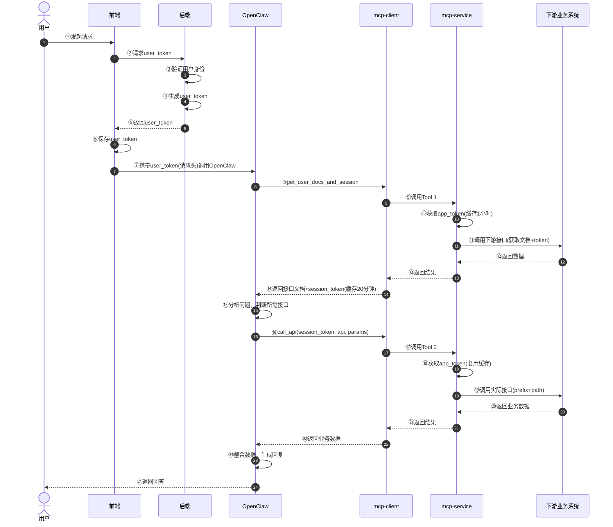

```mermaid
sequenceDiagram
    autonumber
    actor U as 用户
    participant F as 前端
    participant B as 后端
    participant O as OpenClaw
    participant C as mcp-client
    participant S as mcp-service
    participant D as 下游业务系统

    U->>F: ①发起请求
    F->>B: ②请求user_token
    B->>B: ③验证用户身份
    B->>B: ④生成user_token
    B-->>F: ⑤返回user_token
    F->>F: ⑥保存user_token
    F->>O: ⑦携带user_token(请求头)调用OpenClaw
    O->>C: ⑧get_user_docs_and_session
    C->>S: ⑨调用Tool 1
    S->>S: ⑩获取app_token(缓存1小时)
    S->>D: ⑪调用下游接口(获取文档+token)
    D-->>S: ⑫返回数据
    S-->>C: ⑬返回结果
    C-->>O: ⑭返回接口文档+session_token(缓存20分钟)
    O->>O: ⑮分析问题，判断所需接口
    O->>C: ⑯call_api(session_token, api, params)
    C->>S: ⑰调用Tool 2
    S->>S: ⑱获取app_token(复用缓存)
    S->>D: ⑲调用实际接口(prefix+path)
    D-->>S: ⑳返回业务数据
    S-->>C: ㉑返回结果
    C-->>O: ㉒返回业务数据
    O->>O: ㉓整合数据，生成回复
    O-->>U: ㉔返回回答
```
